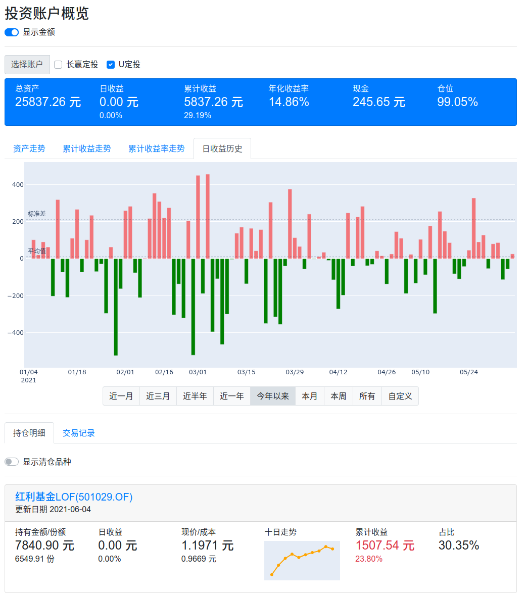
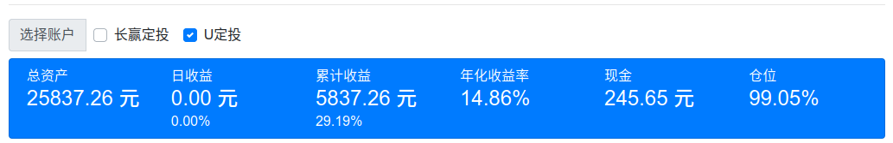
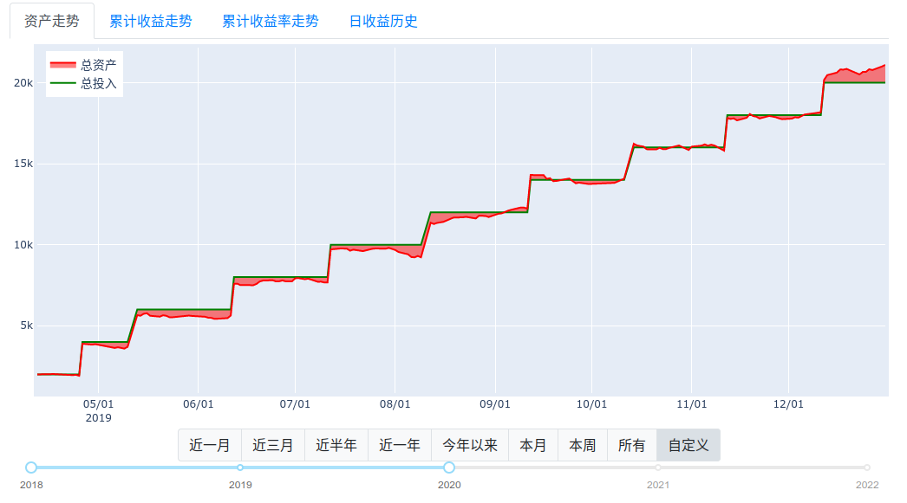
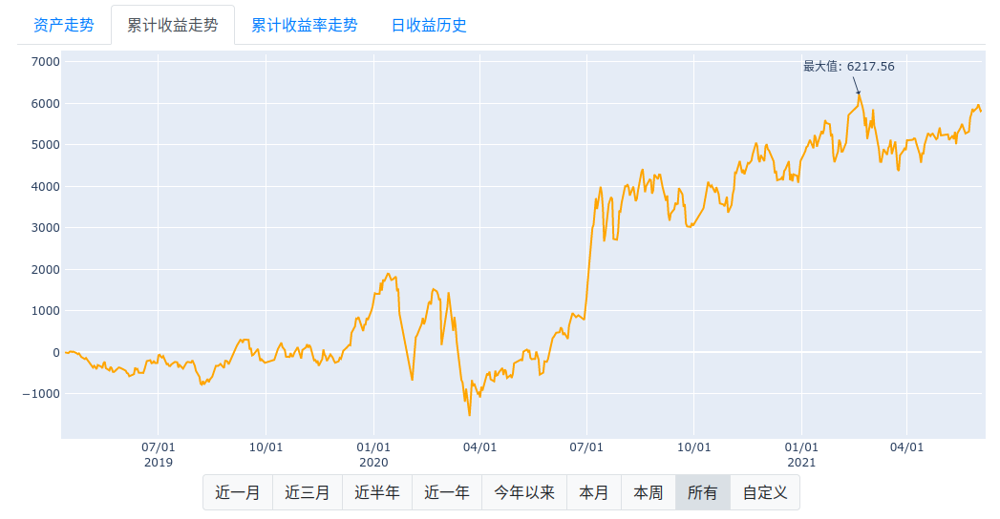
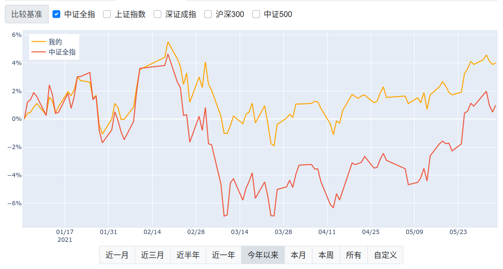
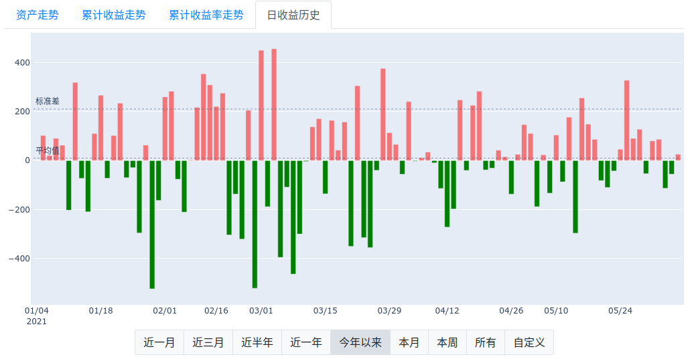
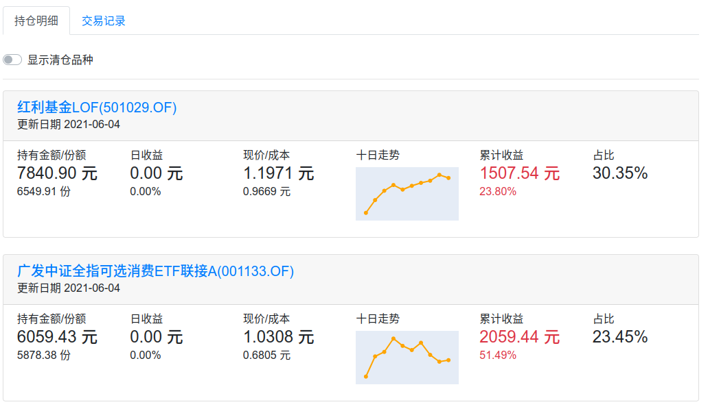
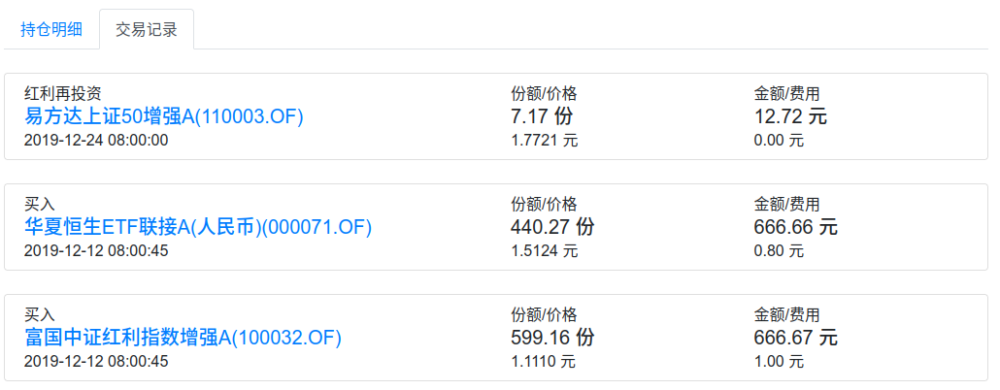
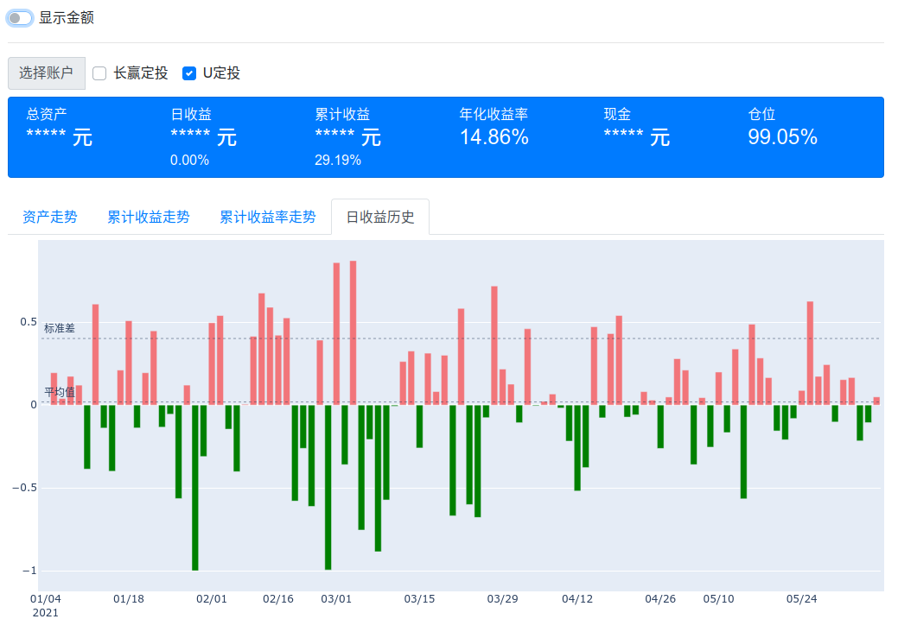
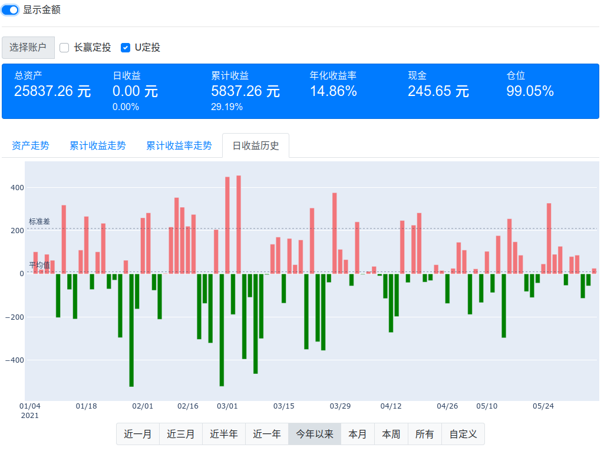

Keysersoze
==========

<!-- TOC -->

- [功能](#功能)
- [使用](#使用)

  - [数据准备](#数据准备)
  - [部署说明](#部署说明)

    - [Docker](#docker)
    - [本地构建](#本地构建)

<!-- /TOC -->

DEMO: http://39.105.155.15:8050/



## 功能

- 展示投资账户的收益状况，包括日收益、累计收益、累计收益率、年化收益率

  

- 展示投资账户指定时间段内的总资产和总投入走势

  

- 展示投资账户指定时间段内累计收益金额的走势，并标识出最大值

  

- 展示投资账户指定时间段内的收益率走势，以及和中证全指等市场基准之间的对比

  

- 以柱状图的形式展示每日收益历史

  

- 展示持仓明细，包括各个投资品种的成本和收益，以及该品种的近期走势

  

- 历史交易记录展示

  

- `显示金额`开关，一键打开或关闭各项数据中的具体金额显示，保护个人隐私

  开关关闭状态

  

  开关打开状态

  

- 多账户支持，选择多个账户后，将视作一个新的虚拟账户，同样能使用上述所有功能

## 使用

### 数据准备

TODO:

- 交易记录导入
- 账户持仓及收益更新

### 部署说明

#### Docker

```shell
docker pull 74ls86/keysersoze:0.2
docker run -d -p 8050:8050 74ls86/keysersoze:0.2
```

#### 本地构建

系统依赖: python3, pip3, virtualenv, Make

- 建立环境，安装依赖

  ```shell
  git clone git@github.com:Linusp/keysersoze && cd keysersoze
  make venv
  source venv/bin/activate
  pip install -r requirements.txt
  ```

- 设置环境变量，指定数据库文件 db.sqlite3 所在目录

  ```shell
  export KEYSERSOZE_DB_DIR=$PWD
  ```

- 启动服务

  ```shell
  python app.py
  ```
